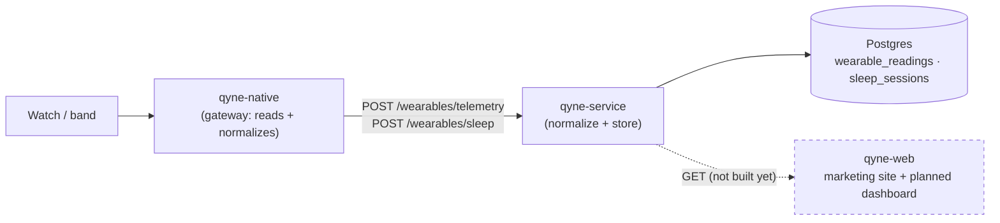

# Wearable data flow — qyne-web

**Read this first if you are new, and read it before you wire a chart to
anything.** It states plainly where this repo sits in the wearable pipeline
today, which numbers on the live site are real and which are illustrative, and
exactly what the athlete dashboard will consume when it is built.

> QYNE is three separate repos (`qyne-native`, `qyne-service`, `qyne-web`) plus
> `qyne-infra`. Cross-repo links here assume they are cloned as siblings in one
> workspace folder — they resolve in your editor, not on GitHub.

---

## 1. Where this repo sits today

**qyne-web consumes no wearable data.** It is a Vite + React marketing and
product site: fully static, no environment variables, no API client.
`@supabase/supabase-js` is a dependency for the planned auth flow but is not
wired up — `pages/Login.tsx` and `pages/Signup.tsx` are UI only.

### The numbers on the site are illustrative, not live

This matters because it is the single easiest thing to misread here.

| Component | What it shows | Source |
|---|---|---|
| `components/sections/HealthTrends.tsx` | 14-day RHR + HRV trend charts, sleep/recovery/strain tiles | **hardcoded arrays in the file** |
| `components/visuals/PerformanceDashboard.tsx` | dashboard mock | static props |
| `components/visuals/RecoveryRing.tsx`, `HrvWaveform.tsx` | recovery ring, HRV waveform | static/animated, no data |
| `components/sections/PlatformData.tsx`, `Wearable.tsx` | how the sync works; which bands connect | marketing copy |
| `pages/Wearable.tsx` | the full wearable story page | composed from the above |

If you change one of those series, you are editing marketing copy, not a
visualization of anyone's health. Conversely: **do not swap one of these for a
live API call without also handling auth, loading, empty and error states** — the
components have no such states today.

Where the illustrative numbers should stay plausible, the definitions that back
them live in [`docs/FORMULAS.md`](../../docs/FORMULAS.md) at the workspace root.

---

## 2. What "canonical" means — the vocabulary you will consume

When the dashboard is built, it will read the same canonical model the app reads.
Learn these names now; they are the contract.

| Canonical metric | Unit | Notes |
|---|---|---|
| `heart_rate` | bpm | raw samples; resting HR is *derived* server-side |
| `hrv` | ms | |
| `spo2` | percent | |
| `skin_temperature` | celsius | |
| `steps` | count | per-day totals stamped at local midnight |
| `active_minutes` | minutes | per-day total |
| `active_energy` | kcal | per-day total |
| `distance` | km | per-day total |
| `battery_level` | percent | device, not athlete |

Provider keys: `jc_vita` (the QYNE band over BLE), `apple_health`,
`health_connect`; `whoop` / `garmin` / `fitbit` / `oura` are declared but not
implemented. Sleep does **not** live in this list — it has its own table and
endpoints (see below).

Defined in `qyne-service/src/wearables/domain/canonical.ts`. Never rename one;
only add.

---

## 3. The endpoints the dashboard will call

All require a Supabase JWT as `Authorization: Bearer <token>`. The user id is
always taken from the token — never send it in a query or body.

| Method | Path | Returns |
|---|---|---|
| `GET` | `/wearables/devices` | The athlete's connected devices |
| `GET` | `/wearables/devices/:deviceId/readings?metric=&limit=` | Canonical readings, newest first (ownership-checked) |
| `GET` | `/wearables/metrics/resting-heart-rate` | `{ restingHr, sampleCount, windowDays }` — 10th percentile of `heart_rate` |
| `GET` | `/wearables/sleep/latest` | Last night **including the raw stage array** — this is what draws a hypnogram |
| `GET` | `/wearables/sleep/sessions?days=` | Lightweight night list, no stage arrays — for pickers |
| `GET` | `/wearables/sleep/analytics?days=` | Averages, stage distribution %, bedtime consistency, per-night rows — **the 3d/1w/1m dashboard endpoint** |
| `GET` | `/readiness?sleepGoalHours=` | The readiness score. ⚠️ Currently on the service's `feat/readiness-endpoint` branch, not mainline — treat it as optional and degrade gracefully, exactly as the app does |
| `GET` | `/privacy/export` | GDPR Art. 15/20 — every device, reading and session |

Live, always-accurate schemas: qyne-service's `/docs` (Swagger, non-production).

### Four things to build around

1. **`/wearables/sleep/analytics` is the one to reach for.** It already returns
   averages, stage distribution and consistency — do not re-aggregate night rows
   in the browser.
2. **Fetch stage arrays only for a single night.** `latest` carries them;
   `sessions` deliberately doesn't. Never pull stage arrays for a range.
3. **Derived numbers come from the server, not the client.** Resting HR, sleep
   efficiency, awakenings and readiness are all computed server-side so the web
   dashboard and the app show the identical number. Recomputing one in the browser
   is how they drift apart.
4. **Empty is the normal first state.** A new athlete has no device, no readings
   and no nights. `analytics` returns `{ nights: 0, averages: null, … }` and
   readiness returns `available: false`. Design for that before the happy path.

### Sleep stage codes

`1` deep · `2` light · `3` REM · anything else awake. The same codes are used by
the band firmware, HealthKit/Health Connect mapping, and the server's derivation.

---

## 4. When you build the dashboard

Suggested order, smallest useful thing first:

1. **Wire auth.** Supabase session → access token → a small authed `fetch` wrapper.
   Mirror `qyne-native/src/lib/api.ts`, which proactively refreshes a token
   expiring within 60 s so the backend never sees a stale one.
2. **Read the two docs below in full** before designing components — the numbers
   have real definitions and units, and getting them wrong is invisible until an
   athlete notices.
3. **Start with `/wearables/sleep/analytics`** — one call backs an entire screen.
4. **Add readiness last**, behind an availability check.
5. **Do not add a client-side normalization layer.** If the shape you want isn't
   available, add it to the server so the app gets it too.

---

## 5. Where everything else is documented

| For | Read |
|---|---|
| How a device's bytes become canonical samples (BLE frames, HealthKit/Health Connect identifiers, per-metric mapping tables) | [`qyne-native/docs/WEARABLE-DATA-FLOW.md`](../../qyne-native/docs/WEARABLE-DATA-FLOW.md) |
| The canonical model, normalization, storage, idempotency, derived metrics | [`qyne-service/docs/WEARABLE-DATA-FLOW.md`](../../qyne-service/docs/WEARABLE-DATA-FLOW.md) |
| Metric definitions and formulas | [`docs/FORMULAS.md`](../../docs/FORMULAS.md) |
| Where the data physically lives | [`qyne-infra/docs/WEARABLE-DATA-FLOW.md`](../../qyne-infra/docs/WEARABLE-DATA-FLOW.md) |
| This repo's own architecture | [`ARCHITECTURE.md`](../ARCHITECTURE.md) |
